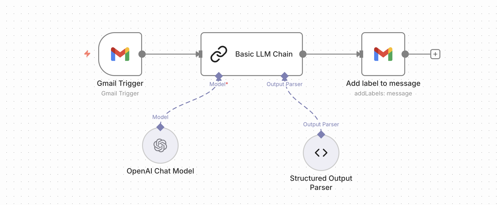

# 📧 AI Smart Inbox: Intelligent Gmail Labeling Agent

## 🌟 Key Features
* **Contextual Analysis**: Goes beyond simple keyword matching; it understands the *intent* of the sender.
* **Dynamic Labeling**: Automatically assigns labels (**Lead**, **Pub**, **Famille**) directly in your Gmail interface.
* **Zero-Inbox Strategy**: Designed to help professionals focus only on high-value "Lead" emails while filtering noise.
* **Structured Output**: Uses an output parser to ensure 100% reliability in label application.

## 🛠️ Workflow Architecture
1. **Gmail Watcher**: Monitors incoming mail at scheduled intervals.
2. **AI Brain (LLM Chain)**: Analyzes the body text using **GPT-4** (or **Gemini 1.5 Flash** for a free tier).
3. **JSON Formatter**: Converts AI reasoning into a clean, machine-readable format.
4. **Action Node**: Executes the `addLabel` command via Gmail API.

## 🚀 Getting Started
1. **Import**: Upload the `Label mails.json` file into your n8n instance.
2. **Credentials**:
   * Setup **Gmail OAuth2** (Google Cloud Console).
   * Add your **OpenAI API Key** (or swap the node for Gemini).
3. **Customization**: Edit the "Basic LLM Chain" prompt to add your own business-specific labels (e.g., "Urgent", "Support", "Invoice").

---
## 📬 Connect with Me
Interested in AI Automation or have a project in mind? Let's connect!

👉 **LinkedIn:** [Anis Mellah](https://www.linkedin.com/in/mellah-anis)
👉 **GitHub:** [@yanis-mlh](https://github.com/yanis-mlh)
👉 **Email:** anisski06@gmail.com

*Maintained by **Yanis** - Marketing Consultant & AI Automation Engineer.*
